# Go Clean Architecture Blueprint

This repository provides a clean, simple, and fast starting point for building Go applications. It is an educational tool and a usable skeleton template for generic Go applications, structured around the principles of **Clean Architecture**.

## About This Project

This project was born from the desire to have a well-documented, understandable, and adaptable foundation for new Go applications. The primary goal is not just to provide code, but to explain the reasoning, solutions, trade-offs, and logic behind every architectural choice. This emphasis on the "why" makes it easier to learn from, re-evaluate, and confidently modify the structure to fit specific needs.

This is a living project, built upon documentation, experience, and trial and error. While it may seem simple, it summarizes learnings from many developed applications with different approaches.

## Guiding Principles

- **Clarity and Rationale:** Every significant decision is documented. I believe that understanding the trade-offs is as important as the final implementation. You will find detailed explanations in the `/docs` directory.
- **Agent-Friendly Structure:** The project structure is designed to be intuitive for both human developers and modern LLM-based agents. A standardized and well-documented layout guides any developer (human or machine) to understand where and how new features should be implemented.
- **Adaptability:** This architecture is a starting point. It can be easily simplified for smaller projects or made more complex to handle greater scopes and requirements.

## Architecture Overview

The architecture is based on the principles of **Clean Architecture**, promoting a clear separation of concerns, testability, and independence from frameworks, UI, and databases.

The core idea is a strict dependency rule: all dependencies flow inwards. The inner layers define interfaces, and the outer layers implement them. This makes the core business logic independent of infrastructure details.

The project is divided into distinct layers:

- **Domain:** The innermost layer, containing core business entities and rules.
- **Service:** Contains application-specific business logic and defines interfaces for outer layers.
- **Adapters (Handlers & Repositories):** The outer layers that interact with the outside world (e.g., HTTP requests, databases).

For a complete and detailed explanation of the layers, data flow, and dependency rules, please read the full [**Architecture Document**](./docs/ARCHITECTURE.md).

## Getting Started

To understand how to build a feature using this template, please follow the [**Getting Started Guide**](./docs/GETTING_STARTED.md).

For answers to common questions about the design choices, check out the [**Frequently Asked Questions (FAQ)**](./docs/FAQ.md).

## Disclaimer

This project represents one of many possible approaches to structuring a Go application. It aims for a generic and sound architecture, but it is not the ultimate solution for every problem. Specific use cases may require a different architecture or a different implementation of certain components.

This is a usable architecture, but it could be easily made more simple or complex depending on the project's objective and scope. There are millions of potential improvements, and this template is a living project that will evolve over time. Mistakes could be made, and things could be infinitely improved if time was not a constraint.

## Contributing

Your feedback and contributions are welcome! If you have a different solution, a new approach, or any questions, please feel free to reach out. Everything that could be relevant for someone to learn from this project will be included in the docs.